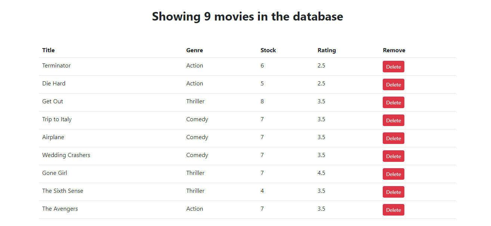

# A list of movies details (vidly)

## Table of contents

- [Overview](#overview)
  - [The challenge](#the-challenge)
  - [Screenshot](#screenshot)
  - [Links](#links)
- [My process](#my-process)
  - [Built with](#built-with)
  - [What I learned](#what-i-learned)
  - [Continued development](#continued-development)
  - [Useful resources](#useful-resources)
- [Author](#author)
- [Acknowledgments](#acknowledgments)


## Overview
 Vidly is a simply web app where you view and delete from a list of movies


### The challenge

Users should be able to:

- View the list of movies availiable in the database
- Delete from a movie from the database
- view the current number of movies as a user delete simultaneously from the database.


### Screenshot




### Links

- Solution URL: [solution URL](https://your-solution-url.com)
- Live Site URL: [live site URL](https://your-live-site-url.com)


## My process


### Built with

- Semantic HTML5 markup
- CSS custom properties
- [React](https://reactjs.org/) - JS library
- [Styled Components](https://getbootstrap.com/) - For styles


### What I learned

- Using Jsx.
- Rendering Lists.
- Conditional Rendering.
- Handling Events.
- Updating States.

```Jsx
 handleDelete = (deletes) => {
    const newMovies = this.state.movies.filter((m) => m._id !== deletes._id);
    this.setState({ movies: newMovies });
  };
```
```css

```
```js
 <main className="container">
      <Movies></Movies>
    </main>
```


### Continued development

- Add where users can add their own movies to the list of movies.
- Have a backend that supports the application.


### Useful resources

- [Resource 1](https://reactjs.org/)- This was the JavaScript library I used to create the project.
- [Resource 2](https://getbootstrap.com/) - This helped me in stylying quickly.


## Author

- Linkdin- [Blessing Victor O.](https://www.linkedin.com/in/blessvic/)
- Twitter - [@bless_iknow](https://twitter.com/bless_iknow)


## Acknowledgments
My thanks to CodeWithMosh for this practical walk through of his React course.